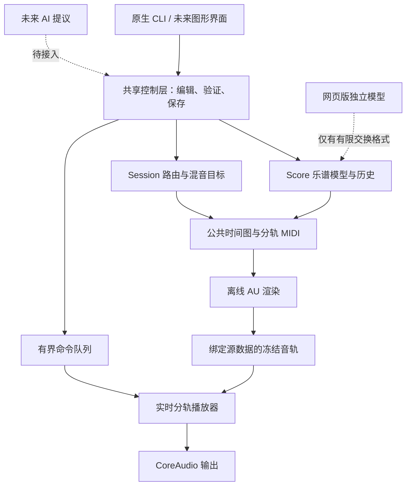

# DAW 框架审视：2026-09-23

范围：本仓库现有 C++ 内核、macOS 适配器、CLI 和浏览器原型的代码审视。
这不是完整专业 DAW 的验收报告，也不是外部项目调研。现有基础可以继续用，
但还需要把分散的能力连成可编辑、可保存、可恢复的制作流程。

## 总体结构与边界



实线表示已存在的主要调用方向，不表示所有编辑已经实现。当前 AI、浏览器与原生
工程统一、实时 AU 发声都未完成。本轮共享控制层只统一**混音编辑**，不是完整文档模型。

## 按影响排序的缺口

| 优先级 | 证据与缺口 | 对使用的影响 | 下一验收条件 |
|---|---|---|---|
| P0 | `ScoreHistory` 只管理乐谱，Session/音源状态/媒体分开保存；之前 `session_play` 的混音修改仅存于播放器 | 退出丢混音，未来 UI 容易和声音状态分叉 | 本轮先闭合混音保存；随后建立统一文档修订、撤销与恢复事务 |
| P0 | `AudioUnitInstrument::render` 是一次性离线渲染；CoreMIDI 回调只计数，没有录音/时间戳桥接 | 不能把外接键盘弹奏、改音符和即时真实音源试听连起来 | 键盘输入→正确乐器→监听→录制→保存重开，并验证延迟/时间戳 |
| P0（部分补齐） | 默认整轨载入上限仍为 512 MiB；新增 `--stream` 工作线程预读与四页固定缓冲，64 轨音频页共 8 MiB | 流式单轨预算为两小时；新 `--stream` AU 导出和 `--stream-frozen` 重混已接通分块缓存、分轨与母带写入 | 已验证定位、欠载同步停表及真实回调；45 分钟合成音轨定位、两小时合成 WAV 写入、短曲真实钢琴/大提琴导出通过；仍须真实长曲、慢盘与长时插件稳定性实测 |
| P1 | 每轨仅有 gain/balance/mute/solo，缺总线、插入效果、发送、自动化和延迟补偿 | 不能完成真实管弦乐混响空间和歌曲混音工作流 | 最小无环处理图、插件/节点延迟对齐、自动化离线/实时一致 |
| P1 | `Score` 没有明确调号/调性图、移调乐器模型和完整演奏法；音高拼写与 MIDI 响音的区别尚未完整建模 | 可以手工选音作曲，但不能宣称完整“定调/移调/管弦乐记谱”已实现 | 调号往返、移调乐器实音/记谱音区分、演奏法到音源参数映射 |
| P1 | AU 插件在宿主进程内运行，支持列表只有 Pianoteq 与 SWAM Cello | 插件崩溃会拖垮宿主，扩乐器需要逐项接入验证 | 插件探测/渲染工作进程、超时取消、状态兼容与失败恢复 |
| P1 | `web/app.js` 另有音符模型、JSON 项目、历史和诊断合成器 | 网页能编辑不等于原生工程能无损打开，控制器/多声部可能不等价 | 定义同一交换契约及金样，再选 WASM 内核或本地服务桥接 |
| P1（部分补齐） | CoreAudio 已加控制线程轮询、故障锁定及显式重连；重连保持暂停，保留位置/混音/历史 | 可在输出故障后继续保存和选择设备；轮询之前仍可能有短暂路由变化，尚非无缝热切换 | 注入故障与真实静音重启通过；继续物理拔插、蓝牙、睡眠唤醒、通知监听和长时实测，见 [设备恢复](output-recovery.md) |
| P2 | 没有实际 AI 工具执行层；Score 编辑还缺稳定音符 ID 和公共命令集 | “AI-DAW”目前是方向，不能声称 AI 已可安全修改完整工程 | AI 提议→命令校验→变更预览→可撤销事务，不直接写 DSP 状态 |

容量例子：32 条立体声 float32 音轨、48 kHz、5 分钟，仅音频就需要约 **3.43 GiB**，
远超默认内存播放路径的 512 MiB 上限。新增流式路径将这 32 轨的音频页缓冲固定在 4 MiB，
仍需在真实大编制素材上验证磁盘吞吐、启动扫描时间和长时运行；不能把容量测试等同于性能验收。
歌曲方面，歌词文本和 MIDI 可以保存，但音频录音、剪辑、takes、歌声处理仍未实现。

## 本轮已落地：混音编辑与保存闭环

- 新增内核 `SessionMixState`，以稳定 part ID 寻址；离线编辑器和实时播放器共用校验规则。
- 实时命令被队列接受后才发布新的可保存目标状态；校验失败、路由不匹配、队列满时
  保持文档不变。保存的是用户已接受的目标，不是 5 ms 渐变中的瞬时采样值。
- `mix` 查看当前目标，`save 新文件名` 在原工程旁另存；保留相同乐谱、AU 状态与冻结音轨引用。
- 保存先写临时文件，完整关闭后以不覆盖的原子硬链接发布；失败不破坏旧文件，
  不清理其他写入者/旧崩溃遗留的暂存目录。不支持硬链接的文件系统明确失败。
- 测试覆盖实时目标与重开输出一致、队列满不记假状态、非法编辑不污染文档、旧文件/
  悬空符号链接保护、竞争保存只有一个成功。

后续迭代已补混音 undo/redo：默认保留最近 128 步单参数编辑，撤销/重做经同一播放队列
生效，失败不改变历史或目标；撤销后保存、重开与试听电平均已验证。历史仅在内存，
重开建立新基线。随后补上混音修改后的自动恢复点：每次打开使用独立目录，恢复前
核对原始 session/score，校验完整性，只另存新文件。真实原生播放器强制退出后，
恢复设置与参考工程的播放数据一致；写入失败有明确提示和重试入口。
随后已补上 [已保存工程的收集与搬迁](session-collection.md)：复制乐谱、音源状态和冻结
音频，校验暂存副本后发布新目录，保留已保存混音；不带入旧导出或恢复历史。
这仍不是整个实时文档的事务保存，也没有磁盘断电持久性保证或完整工程自动保存。
乐谱历史和混音历史的统一仍在待办中，混音恢复不保存撤销历史。

本轮验证：普通 CTest 与 ASan/UBSan 各 31/31 通过；实际工程的原生 CLI 在暂停状态下
另存并重开成功，保存内容与共享离线编辑器一致，源文件哈希保持不变。复现命令：

```sh
python3 scripts/check_session_live_save.py out/swam-note-audit-20260923/corrected
```

## 推进顺序

2026-09-23 收紧后的首个验收已落地：八小节、跨小节延音、踏板与表情曲线，
独立记谱/演奏身份及显式映射，共用谱面/演奏/曲线/增益命令历史，真实
Pianoteq 回调试听和数据保存重开。见 [验收记录与边界](performance-vertical-slice.md)。
旧 ScoreHistory 与 SessionMixState 的工具路径尚未全部迁移；此记录不把单乐器
闭环等同于整套工程模型已统一。

1. 统一文档修订/编辑命令/撤销与恢复，补齐稳定音符 ID 与媒体清单。
2. 并行设计但分步落地：流式音频与单乐器实时输入链；先用小工程验证，再扩到多乐器。
3. 处理图、延迟补偿和基本自动化；随后补调号/演奏法与管弦乐路由。
4. 网页与原生共用数据契约，再加 GUI 和 AI 工具层。避免先包装一个界面来掩盖断开的功能。

每一步都以“编辑→听到→保存→重开复现”验收，不以累计测试数量或页面数量衡量完工程度。
